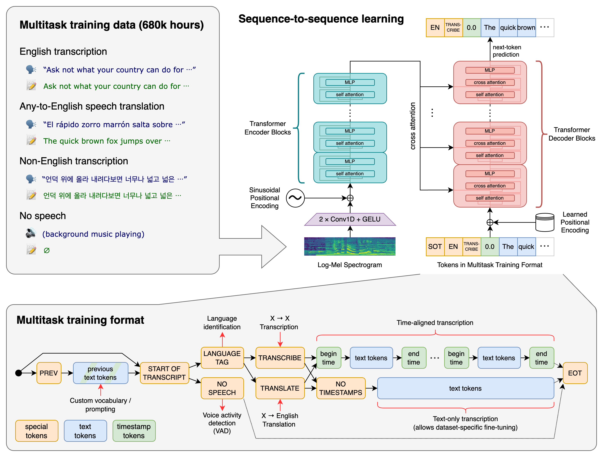

# VideoCut:通过字幕剪辑视频
VideoCut 通过基于OpenAI开源的大语言模型[Whisper](git@github.com:openai/whisper.git)为视频生成字幕,选择需保留的片段字幕重新生成剪辑后的视频
## 1、模型


## 

## 2、工作

- [x] 通过ffmpeg对音频流进行读取
- [x] 通过Whisper为视频生成字幕 (md格式或str格式)
- [ ] 通过字幕生成形成剪辑后视频

## 3、使用

### 3.1、安装ffmpeg
```
sudo apt update && sudo apt install ffmpeg
```
### 3.2、克隆项目
```
git clone git@github.com:ZhengHongChuang/VideoCut.git
cd VideoCut
```
### 3.3、安装Python包

```
pip install -r requirements.txt
```

## 4、Requirements

* ffmpeg_python==0.2.0
* numpy==1.26.4
* openai_whisper==20231117
* OpenCC==1.1.7
* srt==3.5.3
* torch==1.13.1+cu116
* tqdm==4.66.4

## 5、References
* [Robust Speech Recognition via Large-Scale Weak Supervision](https://arxiv.org/abs/2212.04356)
* [Attention Is All You Need](https://arxiv.org/abs/1706.03762v7)

